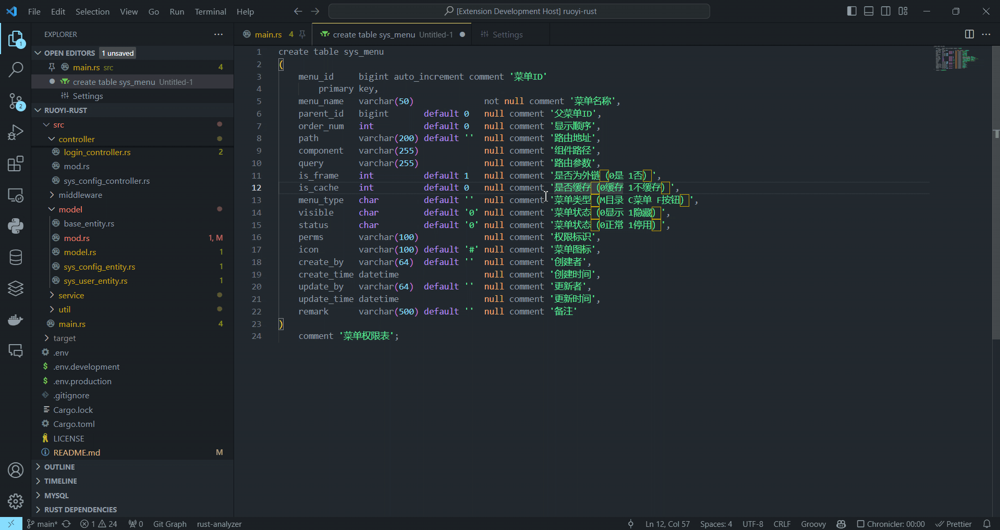

# rust-rbatis-generator README

Use this extension to generate rust-rbatis code from database ddl, currently only support mysql.

## Features

### create rbatis data struct from explorer.

### create rbatis data struct from command.

## Requirements

None.

## Extension Settings

* `rust-rbatis-generator.enable`: Enable/disable this extension.

## Known Issues

None. welcome to submit issues.

## Release Notes

### 0.0.1
add generate code by explorer and command.